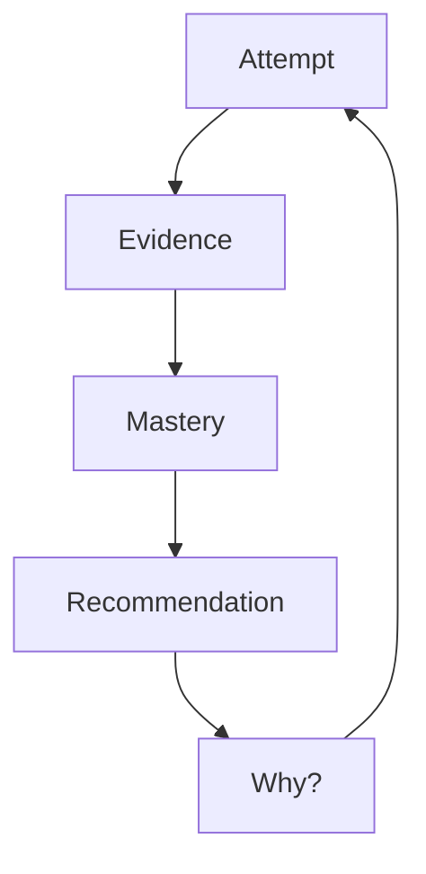
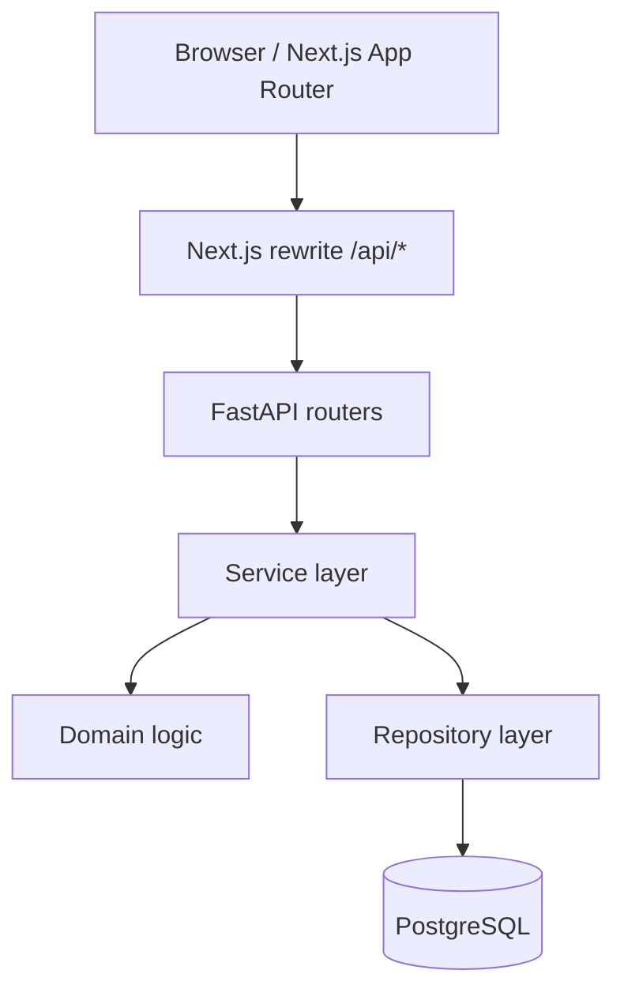

# SkillLens

SkillLens is an evidence-based adaptive learning platform for DSA and technical interview preparation. Instead of treating course completion or raw scores as mastery, SkillLens records what you actually solve, turns each attempt into immutable evidence, computes explainable skill mastery, and recommends the next best problem — with deterministic reasons you can inspect.

## Problem

Most learning platforms answer **“Did you finish?”** or **“What score did you get?”** They rarely answer:

- Which specific skills are weak?
- Why is that skill weak?
- What should I practice next?
- Why this problem and not another?

SkillLens is built to answer those questions from stored evidence, not opaque AI guesses.

## Solution

Every learner action follows one loop:



1. **Attempt** — start a problem, optionally reveal hints, submit outcome
2. **Evidence** — immutable records (solved, failed, hint reliance, etc.)
3. **Mastery** — deterministic score + confidence from weighted evidence
4. **Recommendation** — next best problem from weakness, prerequisites, difficulty, novelty
5. **Why?** — templated explanation sentences tied to reason codes

## Core user journey

1. Register / log in
2. Browse the problem library
3. Start an attempt on a published problem
4. Submit correct/incorrect with optional code sketch
5. See skill movement, evidence, and updated mastery
6. Receive the next recommended problem with explanation
7. Start the recommended problem and repeat

## Key features

- **Explainable mastery** — scores derived from evidence with recency weighting and cold-start honesty (`insufficient` until enough data)
- **Prerequisite-aware recommendations** — direct dependency checks before suggesting advanced skills
- **Deterministic ranking** — no ML, no LLM, no random tie-breaking
- **Atomic submission pipeline** — attempt + evidence + mastery + snapshot + recommendation in one transaction
- **User isolation** — all learner data scoped by authenticated user
- **Portfolio-ready UI** — focused dashboard answering “What should I learn next, and why?”

## Architecture



| Layer | Responsibility |
|-------|----------------|
| Routers | HTTP, auth deps, response models |
| Services | Orchestration, transactions |
| Domain | Pure scoring: evidence, mastery, recommendations |
| Repositories | SQLAlchemy queries |
| Models | ORM + PostgreSQL schema |

## Tech stack

| Area | Technology |
|------|------------|
| Frontend | Next.js 15, React, TypeScript, Tailwind CSS |
| Backend | Python 3.12+, FastAPI |
| Database | PostgreSQL 16 (Docker Compose) |
| Auth | JWT in httpOnly cookies (access + refresh rotation) |
| Migrations | Alembic |
| Testing | pytest, Vitest, Testing Library |
| Linting | Ruff, ESLint |

## Mastery model (V1)

- Evidence items have polarity, strength, and recency (21-day half-life)
- Score = weighted evidence + prior stabilization (prevents one lucky solve → perfect mastery)
- Confidence is separate from score (volume + inconsistency penalty)
- Prerequisite cap limits displayed mastery when direct prerequisites are weak
- `SkillMastery` is a cache; `EvidenceItem` is authoritative history

## Placement readiness (foundation)

SkillLens is adding a placement layer **above** DSA mastery. This phase does not replace the attempt → evidence → mastery → recommendation loop.

| Concept | Meaning |
|---------|---------|
| **Skill** | Atomic learnable ability (`sliding-window`, `hashing`, …) with existing `SkillMastery` |
| **Readiness dimension** | Placement-relevant category (`dsa`, `core_cs`, `projects`, `interview`, `profile`) |
| **Target** | The readiness bar being compared against (a SkillLens profile, e.g. Product SDE) |

**SkillLens target profiles are internal readiness models, not official company hiring requirements.** No company names are hard-coded in scoring logic.

APIs:

- `GET /api/target-profiles`
- `GET` / `PUT /api/me/target`
- `GET /api/me/readiness`

DSA dimension scores are aggregated from **assessed** skills only. Insufficient evidence is **not** treated as 0%. Unimplemented dimensions (Core CS, Projects, Interview, Profile in this phase) stay `not_assessed` with a null score. A learner is not declared placement-ready from DSA strength alone while critical dimensions such as Core CS remain unevaluated.

## Recommendation engine (V1)

Target the weakest assessed skill (or foundational skill on cold start), filter by prerequisite readiness, score candidates on weakness match, difficulty fit, novelty, and spacing, then persist ranked recommendations with JSON explanations.

## Security

- httpOnly cookies for tokens; `Secure` flag in production
- Production startup fails if `JWT_SECRET_KEY` is missing or insecure
- User-scoped queries for attempts, evidence, mastery, recommendations
- No solution/hint leakage in list or recommendation responses
- Global 500 handler returns generic message (no stack traces to clients)
- Structured logging without passwords or tokens

## Testing

```powershell
# Backend (requires PostgreSQL)
cd backend
pytest

# Frontend
cd frontend
npm test
npm run lint
npm run build
```

Current baseline: **137+ backend tests**, **15+ frontend tests**.

## Local setup

### Prerequisites

- Docker Desktop (PostgreSQL)
- Python 3.12+
- Node.js 20+

### 1. Environment

```powershell
Copy-Item .env.example .env
```

### 2. Database

```powershell
docker compose up -d
cd backend
python -m venv .venv
.\.venv\Scripts\Activate.ps1
pip install -r requirements.txt
python -m alembic upgrade head
python -m app.seed
```

### 3. Backend

```powershell
cd backend
uvicorn app.main:app --reload --host 0.0.0.0 --port 8000
```

Health: `GET http://localhost:8000/api/health` → `{ "status": "ok" }`

### 4. Frontend

```powershell
cd frontend
npm install
npm run dev
```

Open [http://localhost:3000](http://localhost:3000). Next.js rewrites `/api/*` to the backend.

## Deploy (CV / live demo)

One Render web service. No Blueprint. No Hugging Face. Database is Neon (Render no longer has free Postgres).

Login after deploy: `demo@skilllens.local` / `demo12345`

### Production Docker (any VPS)

```powershell
# 32+ character secret
$env:JWT_SECRET_KEY = "replace-with-a-long-random-secret-value"
$env:SKILLENS_DEMO_PASSWORD = "the-password-you-will-put-on-your-cv"

docker compose -f docker-compose.prod.yml up --build -d
```

Site: [http://localhost:3000](http://localhost:3000)

Demo login: `demo@skilllens.local` / `$env:SKILLENS_DEMO_PASSWORD`

Put HTTPS in front of port 3000 (Caddy, nginx, Cloudflare Tunnel, or a PaaS). Production cookies are `Secure` and will not work on plain HTTP.

## Demo account

SkillLens can seed a deterministic interviewer demo learner. History is created through the real attempt → evidence → mastery → recommendation pipeline — it is not inserted as fake scores.

Set a password in the environment (do not commit a real password):

```powershell
$env:SKILLENS_DEMO_PASSWORD = "your-local-demo-password"
```

```bash
export SKILLENS_DEMO_PASSWORD="your-local-demo-password"
```

The command fails clearly if `SKILLENS_DEMO_PASSWORD` is missing.

Seed (idempotent; resets only the demo user's learner data):

```powershell
cd backend
python -m app.seed.demo
```

Then log in as:

- **Email:** `demo@skilllens.local`
- **Display name:** Alex
- **Password:** the value of `SKILLENS_DEMO_PASSWORD`

Re-running the command wipes that user's attempts, evidence, mastery, snapshots, and recommendations, then replays the same scripted history. Catalog problems, skills, topics, and other users are left intact.

## Environment variables

| Variable | Description |
|----------|-------------|
| `DATABASE_URL` | PostgreSQL connection string |
| `TEST_DATABASE_URL` | Test database URL |
| `JWT_SECRET_KEY` | **Required in production** (32+ chars) |
| `APP_ENV` | `development` or `production` |
| `ACCESS_TOKEN_EXPIRE_MINUTES` | Access token TTL (default 15) |
| `REFRESH_TOKEN_EXPIRE_DAYS` | Refresh token TTL (default 7) |
| `CORS_ORIGINS` | Comma-separated origins for split deploys |
| `NEXT_PUBLIC_API_URL` | Backend URL for Next.js rewrite |
| `LOG_LEVEL` | Logging level (default INFO) |
| `SKILLENS_DEMO_PASSWORD` | Password for the local demo account (`python -m app.seed.demo`) |

## Production commands

```powershell
# Migrate
cd backend && python -m alembic upgrade head

# Seed catalog (local). Production Docker uses `python -m app.seed.bootstrap`
# so Render cold starts do not wipe the catalog or replay the demo learner.
python -m app.seed

# Backend
uvicorn app.main:app --host 0.0.0.0 --port 8000

# Frontend
cd frontend && npm run build && npm start
```

## Trade-offs

- **Synchronous recommendations** — simple and transactional; no Redis/workers
- **Direct prerequisite checks only** — no full-graph propagation per request
- **Self-reported correctness** — no code judge (intentional V1 scope)
- **No refresh-token revocation list** — documented V2 improvement

## Future improvements

- Code execution / automated judging
- Refresh token revocation
- Spaced repetition (SM-2 style)
- Organization / admin CMS
- Recommendation pruning / archival
- Deeper analytics dashboard

## License

Not specified — add a `LICENSE` file when you choose one.
